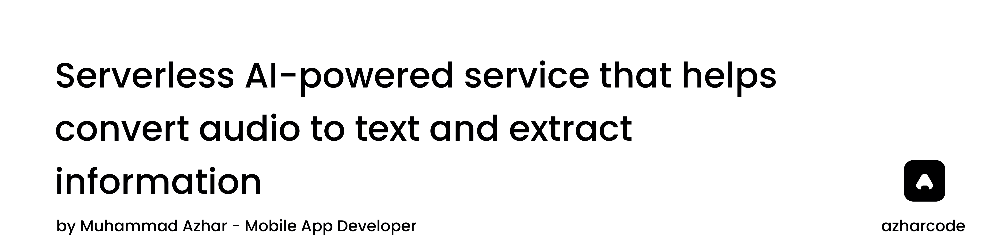

# Schedule-AI Backend

## Overview

Schedule-AI Backend is a serverless AI-powered service that helps convert audio to text and extract structured task information from it. It uses Cloudflare AI models, Whisper for audio-to-text transcription and openai/gpt-oss-120b for extracting task from text.

## Features

- Convert audio files to text
- Extract task information from text
- Structured and reusable API endpoints

## Tech Stack

- TypeScript / Node.js
- Cloudflare Workers (serverless deployment)
- OpenAI Whisper & gpt-oss-120b models

## Architecture & Layers

- **HTTP Layer (`src/index.js`)** – Handles incoming requests and routes them to the appropriate services.
- **Service Layer (`src/schedular/`)** – Orchestrates audio transcription and schedule extraction.
- **AI Layer (`src/llms/`)** – Contains logic for interacting with AI models.
- **Utility Layer (`src/utils/`)** – Provides helper functions like parsing AI responses into structured schedules.

### Flow

1. User uploads audio => `/audio-to-text` endpoint → AI transcription → JSON response
2. User submits text => `/extract-values` endpoint → AI extraction → structured schedule returned
3. Utilities parse the AI response for consistent output

## Usage

- Send audio data to `/audio-to-text` to get transcription
- Send text and timestamp to `/extract-values` to get structured schedule

## License

MIT © Muhammad Azhar Iqbal
